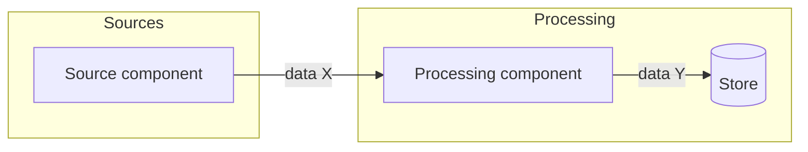

# DATAFLOW__topic

Optional. Draw only the sources, processing and stores that affect understanding.

```mermaid
flowchart LR
    subgraph SRC["Sources"]
        A["Source component"]
    end
    subgraph PROC["Processing"]
        B["Processing component"]
        C[("Store")]
    end
    A -->|"data X"| B
    B -->|"data Y"| C
```
