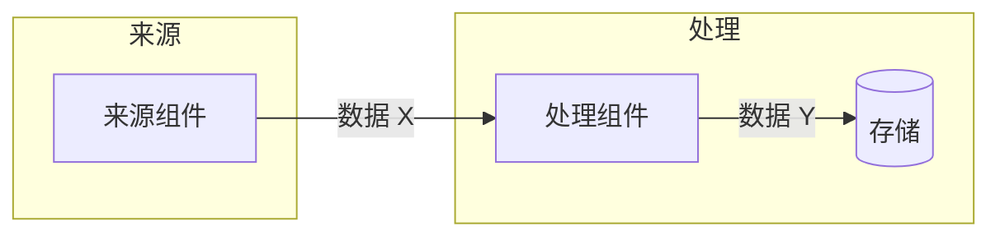

# DATAFLOW__主题

可选模板。只画出影响理解的来源、处理和存储。

```mermaid
flowchart LR
    subgraph SRC["来源"]
        A["来源组件"]
    end
    subgraph PROC["处理"]
        B["处理组件"]
        C[("存储")]
    end
    A -->|"数据 X"| B
    B -->|"数据 Y"| C
```
