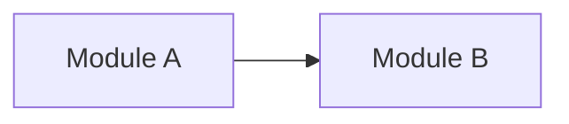

# MODULE__topic

Optional. Draw only the module boundaries and dependencies a reader needs; do not prescribe directory layout.

```mermaid
flowchart LR
    A["Module A"] --> B["Module B"]
```

Key dependency constraints (if needed): …
