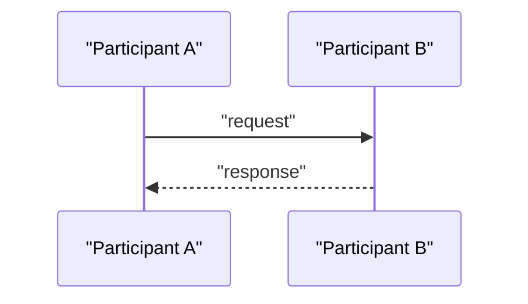

# SEQUENCE__scenario

Optional. Draw only the participants and interactions needed to understand the behavior.

```mermaid
sequenceDiagram
    participant A as "Participant A"
    participant B as "Participant B"

    A->>B: "request"
    B-->>A: "response"
```
