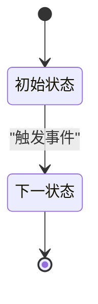

# STATE__实体-lifecycle

可选模板。状态图只用于存在重要生命周期或非法转移风险的实体。

```mermaid
stateDiagram-v2
    state "初始状态" as S0
    state "下一状态" as S1
    [*] --> S0
    S0 --> S1: "触发事件"
    S1 --> [*]
```

---

关键转移条件或禁止转移（需要时）：…
